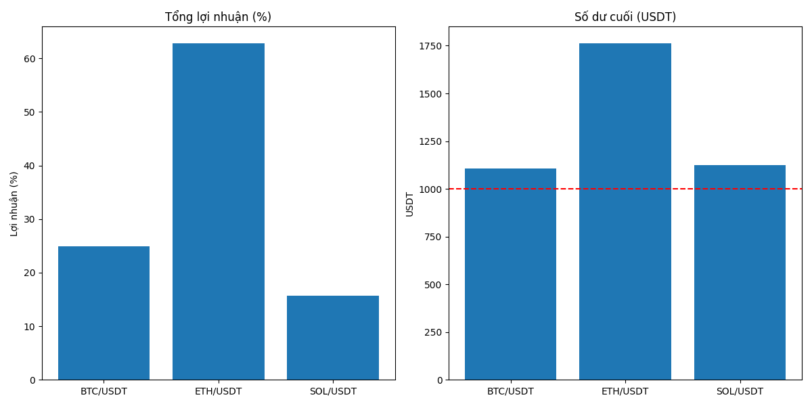

# FreqTrade AI Trading Bot cho Cryptocurrency

Bot giao dịch cryptocurrency sử dụng mô hình AI được tăng cường với LightGBM để tạo tín hiệu giao dịch trên thị trường Futures của Binance.

## Giới thiệu

Dự án này sử dụng các mô hình học máy kết hợp với các chỉ báo kỹ thuật để đưa ra quyết định giao dịch cho các cặp cryptocurrency. Bot được thiết kế để hoạt động trên thị trường Futures Binance, hỗ trợ cả vị thế Long và Short với đòn bẩy động.

## Chức năng chính

1. **Chiến lược AI Tích hợp**: Sử dụng mô hình LightGBM để phân tích xu hướng, biến động và điểm đảo chiều.
2. **Hỗ trợ Futures**: Giao dịch trên thị trường Futures với cả vị thế Long và Short.
3. **Đòn bẩy động**: Điều chỉnh đòn bẩy (2-5x) dựa trên biến động thị trường hiện tại.
4. **Quản lý rủi ro**: Giới hạn cỡ vị thế tối đa 30% cho mỗi cặp giao dịch và cắt lỗ thông minh.
5. **Backtesting**: Khả năng kiểm tra hiệu suất chiến lược trên dữ liệu lịch sử.
6. **Tích hợp GPU**: Tối ưu hiệu suất trên GPU AMD RX6600 bằng ROCm.

## Kết quả mô phỏng



## Cấu trúc dự án

```
├── config/                 # Các file cấu hình
│   ├── config.json         # Cấu hình giao dịch chính
│   └── backtest_config.json # Cấu hình cho backtesting
├── user_data/
│   ├── models/             # Lưu trữ các mô hình AI đã huấn luyện
│   └── strategies/
│       └── enhanced_crypto_strategy.py # Chiến lược giao dịch chính
├── run_freqtrade.py        # Script thực thi FreqTrade
├── setup_workflow.py       # Cấu hình workflow cho Replit
├── simulation.py           # Mô phỏng chiến lược trong môi trường giới hạn
├── train_ai_models.py      # Huấn luyện các mô hình AI
└── simulation_results.png  # Kết quả giả lập giao dịch
```

## Cài đặt và sử dụng

### Huấn luyện mô hình

```
python train_ai_models.py
```

Lệnh này sẽ tải dữ liệu từ Binance, thêm các chỉ báo kỹ thuật và huấn luyện mô hình học máy cho dự đoán xu hướng, biến động và điểm đảo chiều.

### Chạy giả lập

```
python simulation.py
```

Lệnh này sẽ tạo dữ liệu giả lập và chạy chiến lược giao dịch trên dữ liệu này để kiểm tra hiệu suất.

### Chạy Backtesting

```
python run_freqtrade.py --mode backtest
```

### Chạy giao dịch thực

```
python run_freqtrade.py --mode trade
```

## Hiệu suất và mục tiêu

- Mục tiêu lợi nhuận hàng ngày: khoảng 3%
- Quản lý rủi ro thận trọng với đòn bẩy điều chỉnh tự động
- Xác định và tận dụng biến động thị trường một cách thông minh
- Hỗ trợ nhiều cặp tiền để phân tán rủi ro

## Đổi mới và công nghệ

- Sử dụng LightGBM cho hiệu suất và khả năng mở rộng tốt
- Hỗ trợ AMD GPU (RX6600) thông qua ROCm
- Xây dựng chiến lược tự điều chỉnh dựa trên điều kiện thị trường
- Phân tích nhiều khung thời gian để xác nhận tín hiệu